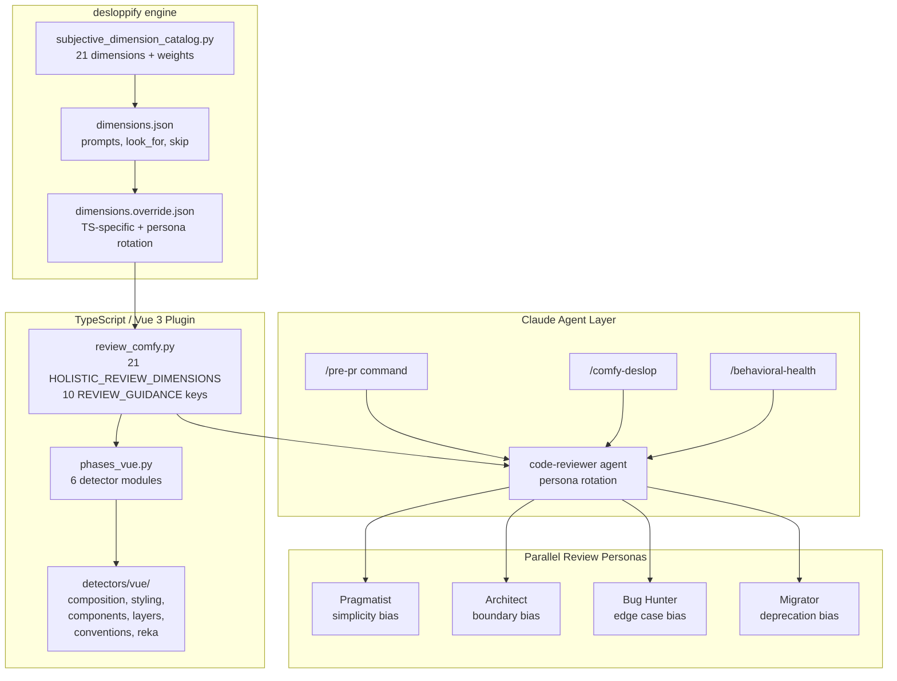

# ComfyUI Frontend Health

Code quality and health checker for the [ComfyUI frontend](https://github.com/Comfy-Org/ComfyUI_frontend) — a Vue 3 + TypeScript + Tailwind 4 application.

Built on [desloppify](https://github.com/peteromallet/desloppify) by **Peter O'Malley (POM)**, forked and retooled for Vue/ComfyUI conventions. Bundles Claude Code agents, skills, and commands for pre-PR quality gating, design system enforcement, and behavioral test auditing.

## Credits

- **[desloppify](https://github.com/peteromallet/desloppify)** by [Peter O'Malley](https://github.com/peteromallet) — the mechanical scanning engine, scoring system, zone management, and subjective review architecture. We fork the TypeScript language plugin and add Vue 3 detectors on top.
- **[Comfy-Org/ComfyUI_frontend](https://github.com/Comfy-Org/ComfyUI_frontend)** — AGENTS.md conventions, code-reviewer agent, skills, and commands are derived from the production repo's `.claude/` configuration.

## Design Philosophy

### Three layers are enough

The system follows a deliberate 3-layer architecture. Each layer has a distinct job and escalation path:

| Layer | What it does | Speed | Signal type |
|-------|-------------|-------|-------------|
| **1. Deterministic** | format, lint, typecheck, knip, convention grep | ~30s | Objective pass/fail |
| **2. Validation** | targeted tests, layer audit, i18n, untested-file detection | ~60s | Behavioral evidence |
| **3. Judgment** | code-reviewer agent with AGENTS.md knowledge | ~120s | Subjective, confidence-scored |

Layer 3 is opt-in (`--review`) because judgment is expensive and should only run when Layers 1-2 pass.

### One strong reviewer, not a swarm

We use a single `code-reviewer` agent rather than multiple specialized agents (styling, types, tests). Reasons:

- One reviewer sees cross-cutting interactions (a type issue that causes a styling workaround)
- Specialized agents re-read the same files and duplicate findings
- Confidence scoring (only report ≥80) controls noise better than agent proliferation
- The agent has a built-in **reflect step** — it challenges each finding before reporting

### Behavioral over mechanical

Convention scanners catch pattern violations. But the more important question is:

> "If this code broke in production, would any test catch it?"

The `/behavioral-health` command and the `test_strategy` review dimension focus on this. A file with zero convention violations but no behavioral tests is more dangerous than one with style issues and solid coverage.

### YAGNI-tested

Every command, dimension, and detector was evaluated against: "Can this be simpler?" Results:

- **Merged** `/test-coverage-gaps` into `/behavioral-health` — they asked the same question
- **Collapsed** 24 review dimensions → 21 — `behavioral_coverage`, `regression_safety`, `test_confidence` folded into `test_strategy`; `implementation_simplicity` checks migrated to `logic_clarity` guidance; added `performance_awareness`
- **Simplified** `/pre-pr` from 5 phases → 2 default stages + 2 opt-in flags
- **Kept** one agent with **persona rotation** — parallel reviews use different lenses (Pragmatist/Architect/Bug Hunter/Migrator) instead of separate specialized agents

## What it adds over upstream desloppify

| Layer | Upstream (generic TS/React) | This fork (Vue/ComfyUI) |
|-------|---------------------------|------------------------|
| **Detectors** | React hooks, context nesting, state sync | Vue composition API, Tailwind tokens, PrimeVue→Reka, layer violations, Reka UI patterns, raw color detection |
| **Review guidance** | useEffect, useState, Context patterns | script setup, defineModel, cn(), semantic tokens, design system, AGENTS.md rules |
| **Boundaries** | generic shared→tools | base→platform→workbench→renderer |
| **Migrations** | class→functional, axios→fetch | Options→Composition, PrimeVue→Reka, withDefaults→destructuring, lodash→es-toolkit |
| **Scoping** | full repo only | + `--pr`, `--diff`, `--staged`, `--files` (via /comfy-deslop) |
| **Agent bundle** | none | 7 skills, 6 commands, 1 agent, AGENTS.md, 7 guidance docs |

## Install

```bash
git clone https://github.com/user/comfy-frontend-health.git
cd comfy-frontend-health
./install.sh /path/to/your/comfyui-frontend
```

This:
1. Installs the desloppify fork (with Vue detectors) via pip
2. Copies Claude Code agents/skills/commands into your project's `.claude/`
3. Installs `/comfy-deslop` as a global Claude Code command

## Commands

Each command has **one job**:

| Command | Job | Default scope |
|---------|-----|--------------|
| `/pre-pr` | Local go/no-go gate before pushing | Changed files vs HEAD~1 |
| `/comfy-deslop` | Repo/folder/file health + debt planning | Full repo or targeted |
| `/comprehensive-pr-review` | Deep PR review with inline GitHub comments | PR diff |
| `/behavioral-health` | Test health audit (missing + weak tests) | Changed files vs main |
| `/add-missing-i18n` | Find and add missing vue-i18n translations | Current branch changes |
| `/verify-visually` | Visual verification via dev server screenshots | Specified pages |

### /pre-pr (the daily driver)

```bash
/pre-pr              # Stage 1 + 2 (~90s) — fast gate
/pre-pr --review     # + code-reviewer agent
/pre-pr --full       # + build + bundle size
/pre-pr --quick      # Stage 1 only (~30s)
```

### /comfy-deslop (debt scanner)

```bash
/comfy-deslop                    # full repo scan with desloppify
/comfy-deslop src/stores/        # focused folder scan
/comfy-deslop MyComponent.vue    # deep single-file review
```

### /behavioral-health (test audit)

```bash
/behavioral-health               # audit changed files vs main
/behavioral-health --full        # full repo test inventory
/behavioral-health src/stores/   # audit specific directory
```

## Vue Detectors

Python regex scanners in `desloppify-fork/desloppify/languages/typescript/detectors/vue/`:

| Detector | What it catches |
|----------|----------------|
| `composition_api.py` | Options API, missing script setup, withDefaults, runtime props, defineSlots, missing defineModel |
| `styling.py` | :class="[]" arrays, dark: variant, !important, arbitrary %, style blocks, **raw Tailwind colors**, **hardcoded hex values** |
| `components.py` | PrimeVue imports, as any, bare any, mixed import type, direct fetch, barrel files |
| `layer_violations.py` | base→platform→workbench→renderer import direction violations |
| `conventions.py` | @ts-expect-error, z.any(), waitForTimeout, composable/store naming, function expressions, script without setup |
| `reka_patterns.py` | Missing as-child, native HTML→Reka UI, missing useForwardProps, PrimeVue dual import, **CVA inline in .vue**, **missing .stories.ts**, **manual state toggle** |

## Review Rubric

`review_comfy.py` provides 21 scoring dimensions (14 upstream + 7 ComfyUI-specific) and 10 guidance categories with 65 total checks:

| Category | Checks | Covers |
|----------|--------|--------|
| vue_composition | 8 | script setup, props, defineModel, state minimization, VueUse |
| typescript_strict | 8 | any/as any, import type, es-toolkit, api helpers, Zod |
| tailwind_styling | 7 | cn(), dark:, !important, fractions, semantic tokens, style blocks |
| architecture | 5 | layer violations, barrel files, naming, PrimeVue |
| testing | 10 | change-detectors, mock-only, behavioral coverage, regression tests |
| design_system | 11 | component inventory, CVA, as-child, forward props, data-[state], stories |
| logic_clarity | 5 | unnecessary abstractions, nesting, expression simplification, generics |
| performance | 6 | O(n²), cleanup leaks, expensive watchers, lazy loading, layout thrashing |
| i18n | 3 | vue-i18n usage, locale files, pluralization |
| naming | 1 | camelCase/PascalCase consistency |

## Agent & Skills

**Agent: `code-reviewer`**
- Senior Vue 3 + TS + Tailwind reviewer with AGENTS.md knowledge
- Confidence scoring: only reports ≥80
- Built-in reflect step — challenges each finding before reporting
- Covers: bugs, test quality, simplification, architecture, design system, API/security

**Skills (7):**

| Skill | Purpose |
|-------|---------|
| `tdd` | Red-green-refactor with Vitest + Vue Test Utils |
| `design-system` | Color palette, semantic tokens, component inventory, layout patterns |
| `shadcn-vue-reka` | Reka UI primitives, CVA variants, useForwardProps, as-child |
| `layer-audit` | Architecture boundary checker (base→platform→workbench→renderer) |
| `writing-playwright-tests` | E2E test authoring with ComfyPage fixtures |
| `writing-storybook-stories` | Storybook story authoring with local conventions |
| `product-design-guideline` | UX heuristics, Nielsen's 10, progressive disclosure |

**Glob-triggered guidance docs (auto-loaded by file type):**

| File pattern | Guidance loaded |
|-------------|----------------|
| `**/*.vue` | `vue-components.md` — Composition API, Reka UI patterns, semantic tokens |
| `**/*.variants.ts` | `cva-variants.md` — CVA structure, semantic token rules |
| `**/*.test.ts` | `vitest.md` — Test quality, mocking, component testing |
| `**/*.spec.ts` | `playwright.md` — E2E patterns, window globals, test tags |
| `**/*.stories.ts` | `storybook.md` — Story structure, variants, mock data |
| `**/*.ts` | `typescript.md` — Type safety, Zod, API utilities, circular deps |

## Architecture



### File Structure

```
comfy-frontend-health/
  desloppify-fork/                # Forked desloppify with Vue detectors
    desloppify/
      languages/typescript/
        detectors/vue/            # Vue 3 / ComfyUI detectors (6 modules)
        phases_vue.py             # Phase runner wiring all detectors
        review_comfy.py           # Vue review guidance (replaces React defaults)
        phases_config.py          # Vue complexity signals (replaces React hooks)
  claude/                         # Agent/skill bundle (copied to target .claude/)
    agents/code-reviewer.md
    skills/                       # 7 skills
    commands/                     # 6 commands
    AGENTS.md                     # Project conventions (source of truth)
    vue-components.md             # Glob: *.vue
    cva-variants.md               # Glob: *.variants.ts
    typescript.md                 # Glob: *.ts
    vitest.md                     # Glob: *.test.ts
    playwright.md                 # Glob: *.spec.ts
    storybook.md                  # Glob: *.stories.ts
    product-design.md             # Design principles reference
  install.sh                      # One-command setup
  README.md
```

## Changes Log

### React → Vue Migration

- **Replaced** React review guidance (`review.py`) with Vue-specific `review_comfy.py`
- **Replaced** React complexity signals (useEffect, useRef, useState counts) with Vue equivalents (watch, composable, lifecycle hook, ref counts)
- **Replaced** React god-component rules (hook count) with Vue rules (watch/composable/ref/lifecycle/prop counts)
- **Replaced** React migration pairs (class→functional, axios→fetch) with Vue pairs (Options→Composition, PrimeVue→Reka, withDefaults→destructuring, lodash→es-toolkit)
- **Removed** React detector directory from active wiring (kept as dead code reference in fork)
- **Fixed** `dimensions.override.json` — React/Next.js → Vue/Nuxt
- **Fixed** `.tsx` glob patterns removed from `typescript.md` and `pre-pr.md`
- **Fixed** Lodash listed as accepted library → flagged as migration target
- **Fixed** Axios removed from accepted libraries list

### New Detectors (not in upstream desloppify)

- `tailwind_raw_color` — catches `bg-blue-500`, `text-gray-700` etc.
- `hardcoded_color_value` — catches `#ff0000` in class/style attributes
- `cva_inline_in_component` — catches `cva({` inside `.vue` files
- `missing_story` — catches `ui/` components without `.stories.ts`
- `reka_manual_state_toggle` — catches `v-if="open"` on Reka-managed state
- `vue_missing_define_model` — catches modelValue prop + emit without defineModel

### Design System Integration

- `vue-components.md` expanded with inline Reka UI patterns + semantic token summary
- `cva-variants.md` created as glob-triggered guidance for `*.variants.ts`
- `code-reviewer` agent updated with Design System section (9 rules)
- `review_comfy.py` design_system guidance expanded from 5 → 11 checks
- `comfy-deslop.md` Components section expanded with design system rules
- `pre-pr.md` convention scan extended with 4 design system checks

### YAGNI Simplification Pass

- **Merged** `/test-coverage-gaps` into `/behavioral-health` (same question, one command)
- **Collapsed** review dimensions 24 → 21 (3 test dimensions → `test_strategy`, `implementation_simplicity` → `logic_clarity`)
- **Simplified** `/pre-pr` from 5 phases (1, 2, 3, 3b, 3c) → 2 stages + 2 opt-in flags
- **Kept** single code-reviewer agent (no specialized agent swarm)
- Behavioral test quality folded into `testing` guidance (10 checks, was 7 + 3 separate categories)

### Post-YAGNI Fixes (logic_clarity gap, weights, performance, personas)

- **Fixed** `logic_clarity` guidance gap — 5 simplicity checks restored from deleted `implementation_simplicity` (abstractions, nesting, expression simplification, generics, overall simplicity)
- **Added** `performance_awareness` dimension (21st) — O(n²), cleanup leaks, expensive watchers, lazy loading, layout thrashing
- **Added** weights for `test_strategy` (8.0) and `dependency_health` (4.0) — previously defaulting to 1.0
- **Added** `performance` guidance category (6 checks) to `COMFY_REVIEW_GUIDANCE`
- **Added** persona rotation for parallel reviews (Pragmatist/Architect/Bug Hunter/Migrator) via `system_prompt_append`
- **Consolidated** `subjective_dimensions_constants.py` — removed duplicate `DISPLAY_NAMES` dict, now imports from `subjective_dimension_catalog.py`

## Recommendations for Future Agents

### When working in this repo

1. **AGENTS.md is the source of truth** — read it before reviewing any code. All rules derive from it.
2. **Run `/pre-pr` before pushing** — it's the fast gate. Use `--review` for deeper analysis.
3. **Use `/behavioral-health --full` periodically** — find test gaps before they become bugs.
4. **Load skills on demand** — don't pre-load all 7 skills. Load `design-system` when reviewing UI, `tdd` when writing tests, etc.

### When extending this toolkit

5. **Don't add commands — add modes.** If a new check could be a flag on an existing command, do that instead of creating a new command.
6. **Don't add agents — improve the reviewer.** One strong agent with good rubric beats a swarm of specialists.
7. **Don't add review dimensions — add subquestions.** If you want to check something new, add it as a check within an existing guidance category.
8. **Test detectors with the actual codebase.** Run `python -c "from desloppify.languages.typescript.detectors.vue.X import detect_X; print(detect_X(Path('src/')))"` to verify detectors find real issues.
9. **Keep glob-triggered docs concise.** They're loaded on every file touch — keep them under 100 lines with pointers to full skills.
10. **Sync with upstream AGENTS.md periodically.** The ComfyUI frontend repo's AGENTS.md evolves. Diff against `claude/AGENTS.md` and update when it drifts.

### When reviewing code

11. **Verify before flagging.** Grep before saying something is unused. Read the implementation before saying a catch block is dead.
12. **Confidence ≥ 80 only.** Don't report issues you're not sure about. False positives erode trust faster than missed issues.
13. **Behavioral tests > convention compliance.** A file with `as any` but solid behavioral tests is safer than a perfectly typed file with no tests.

## How it relates to other tools

| Tool | What it does | Relationship |
|------|-------------|-------------|
| **desloppify** | Generic codebase health engine | We fork it, add Vue detectors |
| **ESLint/oxlint** | Line-level linting | We complement — we catch architectural/design issues linters miss |
| **pnpm typecheck** | TypeScript errors | We integrate as a quality gate in Stage 1 |
| **pnpm knip** | Dead code detection | We integrate as a quality gate in Stage 1 |
| **Vitest** | Unit/component tests | We run targeted tests in Stage 2, audit quality in /behavioral-health |
| **Playwright** | E2E browser tests | We provide writing-playwright-tests skill |
| **Storybook** | Component catalog | We detect missing stories, provide writing-storybook-stories skill |

## Contributing

PRs welcome. The Vue detectors are Python regex scanners — easy to add new patterns. The review guidance is plain text injected into AI agent prompts.

To add a new detector:
1. Add detection function in `desloppify-fork/desloppify/languages/typescript/detectors/vue/`
2. Register it in `phases_vue.py` `_DETECTOR_CONFIG`
3. Add corresponding guidance in `review_comfy.py`
4. Test against the real codebase
