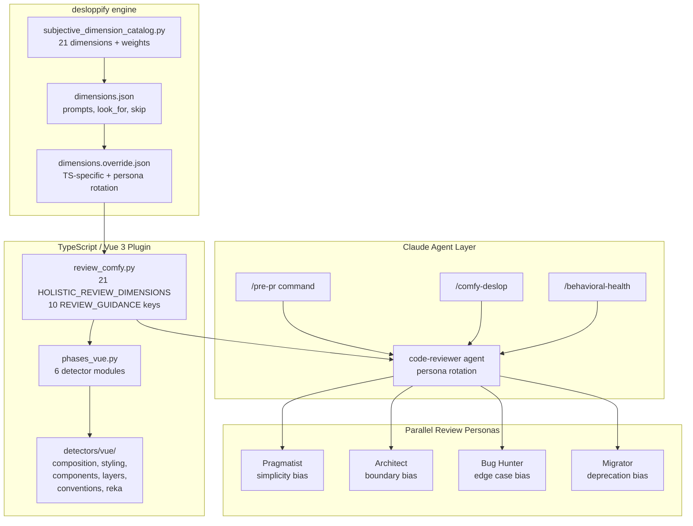

# ComfyUI Frontend Health

Code quality and health checker for the [ComfyUI frontend](https://github.com/Comfy-Org/ComfyUI_frontend) — a Vue 3 + TypeScript + Tailwind 4 application.

Built on [desloppify](https://github.com/peteromallet/desloppify) by **Peter O'Malley**, forked and retooled for Vue/ComfyUI conventions. Bundles Claude Code agents, skills, and commands for pre-PR quality gating, design system enforcement, and behavioral test auditing.

> **Full reference**: [docs/ARCHITECTURE.md](docs/ARCHITECTURE.md) — design philosophy, detector inventory, review rubric, change log.

## Credits

- **[desloppify](https://github.com/peteromallet/desloppify)** by [Peter O'Malley](https://github.com/peteromallet) — scanning engine, scoring, zone management, subjective review architecture
- **[Comfy-Org/ComfyUI_frontend](https://github.com/Comfy-Org/ComfyUI_frontend)** — AGENTS.md conventions, code-reviewer agent, skills, commands

## Install

```bash
git clone https://github.com/user/comfy-frontend-health.git
cd comfy-frontend-health
./install.sh /path/to/your/comfyui-frontend
```

This installs the desloppify fork (with Vue detectors) via pip, copies agents/skills/commands into your project's `.claude/`, and installs `/comfy-deslop` as a global Claude Code command.

## Quick Start

### CLI

```bash
comfy-health scan              # Full repo health scan
comfy-health scan --skip-slow  # Skip duplicate detection
comfy-health check             # Assess subjective quality dimensions
comfy-health status            # Full dashboard with scores
comfy-health show <file>       # Dig into issues for a file or detector
comfy-health diff              # Issues in files changed since last commit
comfy-health branch develop    # Issues in files changed vs a branch
comfy-health next              # Next priority fix from the living plan
```

### Claude Code slash commands

```bash
/pre-pr              # Fast quality gate (~90s) before pushing
/pre-pr --review     # + code-reviewer agent judgment
/pre-pr --quick      # Stage 1 only (~30s)
/behavioral-health   # Test health audit for changed files
/comfy-deslop        # Full repo debt scan
```

## How It Works

Three layers, each with a distinct job:

| Layer | What | Speed | Signal |
|-------|------|-------|--------|
| **1. Deterministic** | format, lint, typecheck, knip, convention grep | ~30s | Pass/fail |
| **2. Validation** | tests, layer audit, i18n, completeness checks | ~60s | Behavioral |
| **3. Judgment** | code-reviewer agent (opt-in `--review`) | ~120s | Scored ≥80 |

**Key principles**: One strong reviewer (not a swarm). Behavioral tests over convention compliance. YAGNI on every feature.

### Architecture



## CLI Reference

### comfy-health

Wrapper around the desloppify engine with friendlier subcommands.

| Command | What it does |
|---------|-------------|
| `comfy-health scan` | Run all detectors, update state, show diff |
| `comfy-health check` | Assess subjective quality dimensions (replaces `review --prepare`) |
| `comfy-health status` | Full project dashboard: score, dimensions, progress |
| `comfy-health show <pattern>` | Dig into issues by file, directory, detector, or ID |
| `comfy-health next` | Next priority item from the living plan |
| `comfy-health backlog` | Broader backlog items |
| `comfy-health plan` | View/update the living plan |
| `comfy-health tree` | Annotated codebase tree |
| `comfy-health viz` | Interactive HTML treemap |
| `comfy-health diff [REF]` | Show issues for files changed since REF (default: HEAD~1) |
| `comfy-health branch [BASE]` | Show issues for files changed vs BASE (default: main) |
| `comfy-health doctor` | Self-check: verify Python, desloppify, project, git |
| `comfy-health --version` | Show version |

Use `--strict` with `diff`/`branch` to exit non-zero when issues are found (CI gate).

Set `COMFY_FRONTEND_PATH` to point at your project root (defaults to current directory).

### Slash commands

| Command | Job | Scope |
|---------|-----|-------|
| `/pre-pr` | Go/no-go gate before pushing | Changed files vs HEAD~1 |
| `/comfy-deslop` | Health score + debt planning | Full repo or targeted |
| `/comprehensive-pr-review` | Deep PR review with GitHub inline comments | PR diff |
| `/behavioral-health` | Test health audit (missing + weak tests) | Changed files vs main |
| `/add-missing-i18n` | Find and add missing vue-i18n translations | Branch changes |
| `/verify-visually` | Visual verification via dev server | Specified pages |

### /pre-pr

```bash
/pre-pr              # Stage 1 (deterministic) + Stage 2 (validation)
/pre-pr --review     # + code-reviewer agent
/pre-pr --full       # + build + bundle size
/pre-pr --quick      # Stage 1 only
```

**Stage 1** runs format, lint, typecheck, knip in parallel, then greps for convention violations (`:class="[]"`, `as any`, `!important`, raw colors, PrimeVue imports, etc.).

**Stage 2** runs tests for changed files, layer audit, i18n check, and flags:
- Source files with no corresponding `.test.ts`
- New composables (`useXyz.ts`) with no colocated test
- New components/routes with no `.spec.ts` in `browser_tests/`
- E2E tests not using ComfyPage fixtures

### /comfy-deslop

```bash
/comfy-deslop                    # full repo scan
/comfy-deslop src/stores/        # focused folder
/comfy-deslop MyComponent.vue    # deep single-file review
/comfy-deslop --staged           # pre-commit check
/comfy-deslop --pr 123           # PR review
```

### /behavioral-health

```bash
/behavioral-health               # changed files vs main
/behavioral-health --full        # full repo inventory
/behavioral-health src/stores/   # specific directory
```

Scores each file 1-5 (Protected → Unprotected) based on behavioral test quality. Also flags completeness gaps: missing loading/error/empty states, prop drilling, keyboard accessibility.

## What It Checks

### Convention Scanners (6 detector modules)

| Detector | Catches |
|----------|---------|
| `composition_api` | Options API, missing script setup, withDefaults, missing defineModel |
| `styling` | :class="[]", dark: variant, !important, raw Tailwind colors, hardcoded hex |
| `components` | PrimeVue imports, as any, mixed import type, direct fetch, barrel files |
| `layer_violations` | base→platform→workbench→renderer import violations |
| `conventions` | @ts-expect-error, z.any(), waitForTimeout, naming violations |
| `reka_patterns` | Missing as-child, native HTML→Reka UI, CVA inline, missing stories |

### Completeness Gaps (8 checks)

Integrated into code-reviewer, /behavioral-health, and /pre-pr:

| Gap | What it catches | Why |
|-----|----------------|-----|
| E2E coverage | New component/route with zero .spec.ts | Nobody notices missing E2E |
| Loading state | Async fetch without Skeleton/spinner | Blank area during load |
| Error boundary | Async component without error fallback | Uncaught error crashes panel |
| Empty state | List with no "nothing here yet" | Empty zone shows blank div |
| Prop drilling | Props through 3+ layers unchanged | Should be composable/store |
| Keyboard nav | Interactive element without keyboard handler | Accessibility gap |
| Composable test | useXyz.ts with no .test.ts | Behavioral gap |
| Playwright fixtures | E2E builds workflow programmatically | Fragile, use JSON fixtures |

### Review Agent

Single `code-reviewer` agent with:
- **Confidence scoring**: only reports ≥80
- **Reflect step**: challenges each finding before reporting
- **Persona rotation**: Pragmatist / Architect / Bug Hunter / Migrator for parallel reviews
- **21 scoring dimensions** across 10 guidance categories (64 total checks)

## Skills & Guidance

**7 skills** (load on demand):

| Skill | When to load |
|-------|-------------|
| `tdd` | Writing tests (red-green-refactor) |
| `design-system` | Reviewing UI, color tokens |
| `shadcn-vue-reka` | Building Reka UI components |
| `layer-audit` | Checking architecture boundaries |
| `writing-playwright-tests` | E2E test authoring |
| `writing-storybook-stories` | Storybook stories |
| `product-design-guideline` | UX review |

**6 glob-triggered docs** (auto-loaded):

| Pattern | Loads |
|---------|-------|
| `*.vue` | `vue-components.md` |
| `*.variants.ts` | `cva-variants.md` |
| `*.test.ts` | `vitest.md` |
| `*.spec.ts` | `playwright.md` |
| `*.stories.ts` | `storybook.md` |
| `*.ts` | `typescript.md` |

## Contributing

PRs welcome — feel free to open issues too. See [docs/ARCHITECTURE.md](docs/ARCHITECTURE.md) for full reference.

**To add a detector**: Add function in `detectors/vue/`, register in `phases_vue.py`, add guidance in `review_comfy.py`, test against the real codebase.

**To add a check**: Don't add commands — add modes. Don't add agents — improve the reviewer. Don't add dimensions — add subquestions within existing guidance categories.
