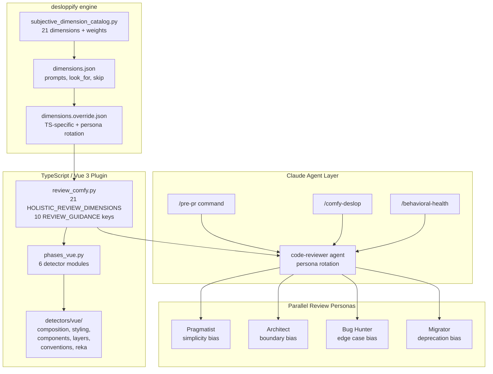

# Architecture & Reference

Full technical reference for [comfy-frontend-health](../README.md). Start with the README for setup and quick reference; come here for design rationale, detector inventory, and change history.

## Design Philosophy

### Three layers are enough

| Layer | What it does | Speed | Signal type |
|-------|-------------|-------|-------------|
| **1. Deterministic** | format, lint, typecheck, knip, convention grep | ~30s | Objective pass/fail |
| **2. Validation** | targeted tests, layer audit, i18n, untested-file detection | ~60s | Behavioral evidence |
| **3. Judgment** | code-reviewer agent with AGENTS.md knowledge | ~120s | Subjective, confidence-scored |

Layer 3 is opt-in (`--review`) because judgment is expensive and should only run when Layers 1-2 pass.

### One strong reviewer, not a swarm

We use a single `code-reviewer` agent rather than multiple specialized agents. Reasons:

- One reviewer sees cross-cutting interactions (a type issue that causes a styling workaround)
- Specialized agents re-read the same files and duplicate findings
- Confidence scoring (only report ≥80) controls noise better than agent proliferation
- The agent has a built-in **reflect step** — it challenges each finding before reporting

### Behavioral over mechanical

Convention scanners catch pattern violations. But the more important question is:

> "If this code broke in production, would any test catch it?"

The `/behavioral-health` command and the `test_strategy` review dimension focus on this. A file with zero convention violations but no behavioral tests is more dangerous than one with style issues and solid coverage.

### YAGNI-tested

Every command, dimension, and detector was evaluated against: "Can this be simpler?" Results:

- **Merged** `/test-coverage-gaps` into `/behavioral-health` — they asked the same question
- **Collapsed** 24 review dimensions → 21 — `behavioral_coverage`, `regression_safety`, `test_confidence` folded into `test_strategy`; `implementation_simplicity` checks migrated to `logic_clarity` guidance; added `performance_awareness`
- **Simplified** `/pre-pr` from 5 phases → 2 default stages + 2 opt-in flags
- **Kept** one agent with **persona rotation** — parallel reviews use different lenses (Pragmatist/Architect/Bug Hunter/Migrator) instead of separate specialized agents

## Architecture



### CLI: comfy-health

`comfy-health` is a wrapper script that maps user-friendly subcommands to the desloppify engine. Set `COMFY_FRONTEND_PATH` to your project root (defaults to current directory).

| comfy-health command | Maps to | Notes |
|---------------------|---------|-------|
| `comfy-health scan` | `desloppify scan` | Run all detectors |
| `comfy-health check` | `desloppify review --prepare` | Assess subjective quality dimensions |
| `comfy-health check --import FILE` | `desloppify review --import FILE` | Import completed review |
| `comfy-health status` | `desloppify status` | Full dashboard |
| `comfy-health show <pattern>` | `desloppify show <pattern>` | Dig into issues |
| `comfy-health next` | `desloppify next` | Next priority item |
| `comfy-health backlog` | `desloppify backlog` | Broader backlog |
| `comfy-health plan` | `desloppify plan` | View/update living plan |
| `comfy-health tree` | `desloppify tree` | Annotated codebase tree |
| `comfy-health viz` | `desloppify viz` | Interactive HTML treemap |
| `comfy-health diff [REF]` | `git diff` + `desloppify show` per file | Show issues for changed files since REF (default: HEAD~1) |
| `comfy-health branch [BASE]` | `git merge-base` + `desloppify show` per file | Show issues for changed files vs BASE (default: main) |
| `comfy-health --version` | `git describe` | Show version |

All other subcommands and flags are forwarded directly to desloppify.

### File Structure

```
comfy-frontend-health/
  comfy-health                    # CLI wrapper script
  desloppify-fork/                # Forked desloppify with Vue detectors
    desloppify/
      languages/typescript/
        detectors/vue/            # Vue 3 / ComfyUI detectors (6 modules)
        phases_vue.py             # Phase runner wiring all detectors
        review_comfy.py           # Vue review guidance (replaces React defaults)
        phases_config.py          # Vue complexity signals (replaces React hooks)
  claude/                         # Agent/skill bundle (copied to target .claude/)
    agents/code-reviewer.md
    skills/                       # 7 skills
    commands/                     # 6 commands
    AGENTS.md                     # Project conventions (source of truth)
    vue-components.md             # Glob: *.vue
    cva-variants.md               # Glob: *.variants.ts
    typescript.md                 # Glob: *.ts
    vitest.md                     # Glob: *.test.ts
    playwright.md                 # Glob: *.spec.ts
    storybook.md                  # Glob: *.stories.ts
    product-design.md             # Design principles reference
  docs/                           # Extended documentation
    ARCHITECTURE.md               # This file
  install.sh                      # One-command setup
  README.md
```

## What It Adds Over Upstream Desloppify

| Layer | Upstream (generic TS/React) | This fork (Vue/ComfyUI) |
|-------|---------------------------|------------------------|
| **Detectors** | React hooks, context nesting, state sync | Vue composition API, Tailwind tokens, PrimeVue→Reka, layer violations, Reka UI patterns, raw color detection |
| **Review guidance** | useEffect, useState, Context patterns | script setup, defineModel, cn(), semantic tokens, design system, AGENTS.md rules |
| **Boundaries** | generic shared→tools | base→platform→workbench→renderer |
| **Migrations** | class→functional, axios→fetch | Options→Composition, PrimeVue→Reka, withDefaults→destructuring, lodash→es-toolkit |
| **Scoping** | full repo only | + `--pr`, `--diff`, `--staged`, `--files` (via /comfy-deslop) |
| **Agent bundle** | none | 7 skills, 6 commands, 1 agent, AGENTS.md, 7 guidance docs |

## Vue Detectors

Python regex scanners in `desloppify-fork/desloppify/languages/typescript/detectors/vue/`:

| Detector | What it catches |
|----------|----------------|
| `composition_api.py` | Options API, missing script setup, withDefaults, runtime props, defineSlots, missing defineModel |
| `styling.py` | :class="[]" arrays, dark: variant, !important, arbitrary %, style blocks, **raw Tailwind colors**, **hardcoded hex values** |
| `components.py` | PrimeVue imports, as any, bare any, mixed import type, direct fetch, barrel files |
| `layer_violations.py` | base→platform→workbench→renderer import direction violations |
| `conventions.py` | @ts-expect-error, z.any(), waitForTimeout, composable/store naming, function expressions, script without setup |
| `reka_patterns.py` | Missing as-child, native HTML→Reka UI, missing useForwardProps, PrimeVue dual import, **CVA inline in .vue**, **missing .stories.ts**, **manual state toggle** |

## Review Rubric

`review_comfy.py` provides 21 scoring dimensions (14 upstream + 7 ComfyUI-specific) and 10 guidance categories with 64 total checks:

| Category | Checks | Covers |
|----------|--------|--------|
| vue_composition | 8 | script setup, props, defineModel, state minimization, VueUse |
| typescript_strict | 8 | any/as any, import type, es-toolkit, api helpers, Zod |
| tailwind_styling | 7 | cn(), dark:, !important, fractions, semantic tokens, style blocks |
| architecture | 5 | layer violations, barrel files, naming, PrimeVue |
| testing | 10 | change-detectors, mock-only, behavioral coverage, regression tests |
| design_system | 11 | component inventory, CVA, as-child, forward props, data-[state], stories |
| logic_clarity | 5 | unnecessary abstractions, nesting, expression simplification, generics |
| performance | 6 | O(n²), cleanup leaks, expensive watchers, lazy loading, layout thrashing |
| i18n | 3 | vue-i18n usage, locale files, pluralization |
| naming | 1 | camelCase/PascalCase consistency |

## Agent & Skills

**Agent: `code-reviewer`**
- Senior Vue 3 + TS + Tailwind reviewer with AGENTS.md knowledge
- Confidence scoring: only reports ≥80
- Built-in reflect step — challenges each finding before reporting
- Covers: bugs, test quality, completeness gaps, simplification, architecture, design system, API/security

**Skills (7):**

| Skill | Purpose |
|-------|---------|
| `tdd` | Red-green-refactor with Vitest + Vue Test Utils |
| `design-system` | Color palette, semantic tokens, component inventory, layout patterns |
| `shadcn-vue-reka` | Reka UI primitives, CVA variants, useForwardProps, as-child |
| `layer-audit` | Architecture boundary checker (base→platform→workbench→renderer) |
| `writing-playwright-tests` | E2E test authoring with ComfyPage fixtures |
| `writing-storybook-stories` | Storybook story authoring with local conventions |
| `product-design-guideline` | UX heuristics, Nielsen's 10, progressive disclosure |

**Glob-triggered guidance docs (auto-loaded by file type):**

| File pattern | Guidance loaded |
|-------------|----------------|
| `**/*.vue` | `vue-components.md` — Composition API, Reka UI patterns, semantic tokens |
| `**/*.variants.ts` | `cva-variants.md` — CVA structure, semantic token rules |
| `**/*.test.ts` | `vitest.md` — Test quality, mocking, component testing |
| `**/*.spec.ts` | `playwright.md` — E2E patterns, window globals, test tags |
| `**/*.stories.ts` | `storybook.md` — Story structure, variants, mock data |
| `**/*.ts` | `typescript.md` — Type safety, Zod, API utilities, circular deps |

## How It Relates to Other Tools

| Tool | What it does | Relationship |
|------|-------------|-------------|
| **desloppify** | Generic codebase health engine | We fork it, add Vue detectors |
| **ESLint/oxlint** | Line-level linting | We complement — we catch architectural/design issues linters miss |
| **pnpm typecheck** | TypeScript errors | We integrate as a quality gate in Stage 1 |
| **pnpm knip** | Dead code detection | We integrate as a quality gate in Stage 1 |
| **Vitest** | Unit/component tests | We run targeted tests in Stage 2, audit quality in /behavioral-health |
| **Playwright** | E2E browser tests | We provide writing-playwright-tests skill + fixture enforcement |
| **Storybook** | Component catalog | We detect missing stories, provide writing-storybook-stories skill |

## Extending the Toolkit

### When working in this repo

1. **AGENTS.md is the source of truth** — read it before reviewing any code
2. **Run `comfy-health scan` or `/pre-pr` before pushing** — scan is the full check, `/pre-pr` is the fast gate. Use `--review` for deeper analysis
3. **Run `comfy-health check` to assess subjective dimensions** — this prepares the review packet for quality scoring
4. **Use `comfy-health status` or `/behavioral-health --full` periodically** — find test gaps before they become bugs
5. **Load skills on demand** — load `design-system` when reviewing UI, `tdd` when writing tests

### When extending

5. **Don't add commands — add modes.** New check → flag on existing command
6. **Don't add agents — improve the reviewer.** One strong agent with good rubric beats a swarm
7. **Don't add review dimensions — add subquestions.** New concern → check within existing guidance category
8. **Test detectors with the actual codebase.** Run against real files to verify detectors find real issues
9. **Keep glob-triggered docs concise.** Under 100 lines with pointers to full skills
10. **Sync with upstream AGENTS.md periodically.** Diff against `claude/AGENTS.md` when it drifts

### When reviewing code

11. **Verify before flagging.** Grep before saying something is unused
12. **Confidence ≥ 80 only.** False positives erode trust faster than missed issues
13. **Behavioral tests > convention compliance.** Solid tests with `as any` beats perfect types with no tests

## Changes Log

### Completeness Gap Checks (v2)

Added 8 gap detections integrated into existing review infrastructure (no new commands/agents):

- **E2E coverage** — flags new components/routes with zero .spec.ts
- **Loading states** — flags async data fetching without Skeleton/spinner
- **Error boundaries** — flags async components without error fallback
- **Empty states** — flags list components with no empty case
- **Prop drilling** — flags props passed through 3+ layers unchanged
- **Keyboard nav** — flags interactive elements without keyboard handlers
- **Composable tests** — flags new useXyz.ts with no colocated .test.ts
- **Playwright fixtures** — flags E2E tests that build workflows programmatically

All checks added as subquestions in code-reviewer agent, scoring signals in /behavioral-health, and warnings in /pre-pr Stage 2. Follows "don't add commands, add modes" principle.

### React → Vue Migration

- **Replaced** React review guidance (`review.py`) with Vue-specific `review_comfy.py`
- **Replaced** React complexity signals (useEffect, useRef, useState counts) with Vue equivalents
- **Replaced** React migration pairs with Vue pairs (Options→Composition, PrimeVue→Reka, withDefaults→destructuring, lodash→es-toolkit)
- **Removed** React detector directory from active wiring
- **Fixed** `dimensions.override.json` — React/Next.js → Vue/Nuxt
- **Fixed** `.tsx` glob patterns removed, Lodash flagged as migration target, Axios removed

### New Detectors (not in upstream)

- `tailwind_raw_color` — catches `bg-blue-500`, `text-gray-700` etc.
- `hardcoded_color_value` — catches `#ff0000` in class/style attributes
- `cva_inline_in_component` — catches `cva({` inside `.vue` files
- `missing_story` — catches `ui/` components without `.stories.ts`
- `reka_manual_state_toggle` — catches `v-if="open"` on Reka-managed state
- `vue_missing_define_model` — catches modelValue prop + emit without defineModel

### Design System Integration

- `vue-components.md` expanded with Reka UI patterns + semantic token summary
- `cva-variants.md` created as glob-triggered guidance for `*.variants.ts`
- `code-reviewer` agent updated with Design System section (9 rules)
- `review_comfy.py` design_system guidance expanded from 5 → 11 checks

### YAGNI Simplification Pass

- **Merged** `/test-coverage-gaps` into `/behavioral-health`
- **Collapsed** review dimensions 24 → 21
- **Simplified** `/pre-pr` from 5 phases → 2 stages + 2 opt-in flags
- **Kept** single code-reviewer agent (no specialized agent swarm)

### Post-YAGNI Fixes

- **Fixed** `logic_clarity` guidance gap — 5 simplicity checks restored
- **Added** `performance_awareness` dimension (21st)
- **Added** weights for `test_strategy` (8.0) and `dependency_health` (4.0)
- **Added** persona rotation (Pragmatist/Architect/Bug Hunter/Migrator) via `system_prompt_append`
- **Consolidated** `subjective_dimensions_constants.py`

### CLI & Infrastructure (v3)

- **Added** `comfy-health` CLI wrapper with `diff`, `branch`, `doctor`, `--version`, `--strict`
- **Added** `doctor` self-check — verifies Python 3.11+, desloppify, project files, state, git
- **Added** `--strict` flag for `diff`/`branch` — exits non-zero when issues found (CI gate)
- **Added** shell completions (bash + zsh) installed via `install.sh`
- **Added** CI workflow (`.github/workflows/health.yml`) — pytest + CLI smoke tests
- **Added** test suites: `tests/test_cli.sh` (13 CLI tests), `tests/test_review_comfy.py` (8 pytest tests)
- **Fixed** install.sh step numbering, pip fallback message, check count 65→64
- **Fixed** `pre-pr.md` grep logic inversion for ComfyPage detection
- **Fixed** dead code branch in `check` subcommand

## Roadmap

### Scan result caching & delta tracking

Currently each `comfy-health scan` produces a full snapshot. Future improvement: persist scan results with timestamps and automatically show deltas ("3 issues resolved, 2 new since last scan"). The `.desloppify/` state already tracks this partially — expose it through `comfy-health status --delta`.

### Recursive learning with embeddings

When agents fix issues found by comfy-health, the fix patterns (problem → solution) can be embedded and stored in a local vector DB (e.g., ChromaDB). Over time this builds a project-specific knowledge base:

1. **Capture**: After each successful fix, store the issue description + diff + context as an embedding
2. **Recall**: When `comfy-health show` or the code-reviewer encounters a similar issue, query the vector DB for prior successful fixes
3. **Apply**: Suggest proven fix patterns ranked by similarity, reducing repeat mistakes

This could live as a desloppify plugin or a separate `comfy-health learn` / `comfy-health suggest` command pair. Per-project DB keeps context relevant. See issue tracker for progress.

### Per-project agent configuration

`install.sh` copies a standard agent/skill set. Future: `comfy-health init` generates a project-specific `.comfy-health.yml` that agents read to configure:
- Which detectors to enable/disable
- Custom dimension weights
- Project-specific convention overrides
- CI strictness level (which findings block PRs)

## Contributing

PRs welcome. The Vue detectors are Python regex scanners — easy to add new patterns. The review guidance is plain text injected into AI agent prompts.

To add a new detector:
1. Add detection function in `desloppify-fork/desloppify/languages/typescript/detectors/vue/`
2. Register it in `phases_vue.py` `_DETECTOR_CONFIG`
3. Add corresponding guidance in `review_comfy.py`
4. Test against the real codebase
